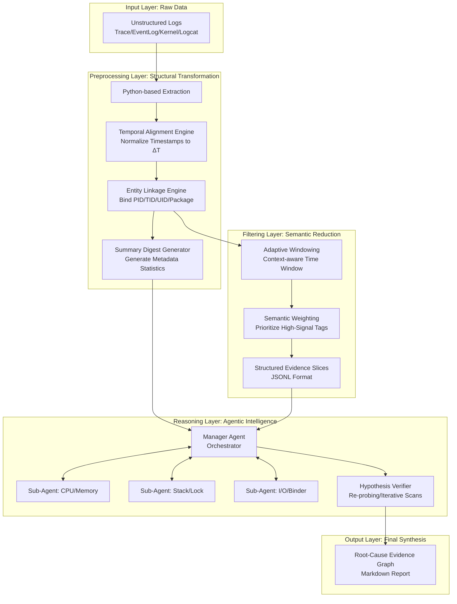

# ANR Intelligent Analysis System: Architectural Specification (v2.0)

## 1. System Mission
To transform massive, unstructured, and multi-source Android log dumps (Trace, EventLog, Kernel, Logcat) into high-fidelity, actionable root-cause diagnostic reports using an Agent-driven, hierarchical reasoning engine.

##  2. Core Architecture (The "Analyze-by-Evidence" Pipeline)

The system operates on a four-layer decoupled architecture, moving from **Raw Data** $\rightarrow$ **Evidence Slices** $\rightarrow$ **Hypothesis Generation** $\rightarrow$ **Causal Conclusion**.



---

## 3. Key Design Principles (The "Optimized" Core)

### 3.1 Data Transformation: From "Text" to "Evidence Slices"
The system does **not** pass raw text to the LLM. It passes **Structured Evidence Slices**.
*   **Temporal Alignment ($\Delta T$):** All timestamps (EventLog, Kernel, etc.) are normalized relative to the $T_{anr}$ (the time of the `am_anr` event). All logs are expressed as `timestamp_iso` and `offset_from_anr: +/- Xs`.
*   **Entity Linkage:** The preprocessing layer proactively links disparate identifiers. A thread ID (TID) found in a `trace` is explicitly mapped to its parent Process ID (PID) and Package Name in the metadata, ensuring the Agent does not lose context across files.
*   **The Summary Digest:** Every analysis run generates a "Digest" (a low-token metadata summary). This includes:
    *   *Search Statistics*: Number of errors found, frequency of process deaths.
    *   *Environmental Snapshot*: System-wide pressure (Memory, CPU, I/O).
    *   *Entity Map*: A registry of all active PIDs/UIDs involved in the window.

### 3.2 Intelligent Filtering: Semantic & Adaptive
To prevent "Context Flooding," the filtering layer uses:
*   **Adaptive Windowing**: The time window is not fixed at 12s. For `InputDispatching` ANRs, the window expands to 30s to capture the preceding event stream.
*   **Semantic Sensitivity Weighting**: Tags are assigned a priority weight.
    *   **Level 1 (Critical)**: `am_anr`, `am_crash` (Primary triggers).
    *   **Level 2 (Warning)**: `am_kill`, `binder_transaction_timeout` (Potential causes).
    *   **Level 3 (Contextual)**: `battery_level`, `wm_task_moved` (Environmental background).
    *   *Result*: The Agent receives a high-density stream of high-signal events.

### 3.3 Reasoning Engine: Hypothesis-Driven Verification
The Analysis Layer uses an **Iterative Reasoning Loop** to avoid premature convergence.
1.  **Initial Hypothesis**: Sub-agents analyze the "Summary Digest" and "Evidence Slices" to propose a theory (e.g., "Binder deadlock in PID 1234").
2.  **Iterative Re-sampling (The Probe)**: The Manager Agent can trigger a `re-probe` command. The script is re-run with a new, highly localized time window or a specific focus on a single thread/component.
3.  **Final Synthesis**: The `root-cause-reporter` compiles the causal chain: `[Trigger] $\rightarrow$ [Intermediate Symptom] $\rightarrow$ [Root Cause]`.

---

## 4. Data Schema (The "Contract" between Script and AI)

All analysis-ready data must conform to the **Evidence Slice Schema (ESS)**:

```json
{
  "metadata": {
    "anr_timestamp": "2026-05-01T09:00:15.000Z",
    "target_package": "com.example.app",
    "digest": {
      "total_events_analyzed": 450,
      "critical_findings": ["am_proc_died", "binder_error"],
      "system_pressure": "High (Memory)"
    }
    "entity_map": {
      "pid_1234": { "package": "com.example.app", "uid": 10002 }
    }
  },
  "evidence_slices": [
    {
      "source": "eventlog",
      "timestamp_iso": "2026-05-01T09:00:03.000Z",
      "delta_t_seconds": -12.0,
      "tag": "am_proc_died",
      "content": "am_proc_died: [0,1234,com.example.app,...]",
      "importance": "CRITICAL"
    },
    {
      "source": "kernel",
      "timestamp_iso": "2026-05-01T09:00:10.000Z",
      "delta_t_seconds": -5.0,
      "tag": "oom_killer",
      "content": "Out of memory: Kill process 1234...",
      "importance": "WARNING"
    }
  ]
}
```

## 5. Implementation Roadmap
*   [x] **Architecture Design (v2.0)**
*   [ ] **Phase 1**: Implement `Temporal Alignment` & `Summary Digest` in `anr_preprocessor.py`.
*   [ ] **Phase 2**: Implement `Semantic Weighting` in `anr_log_pattern_filter.py`.
*   [ ] **Phase 3**: Implement `Hypothesis-driven` Agent loop with Re-probing capability.
