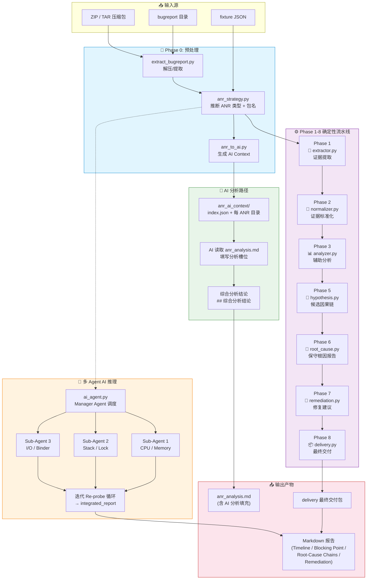
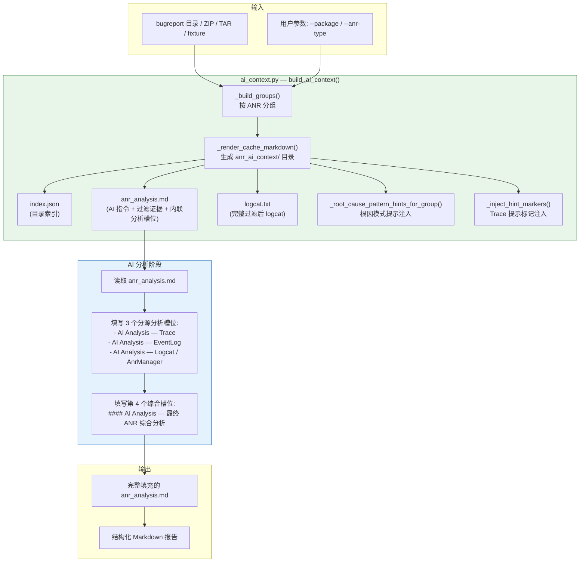
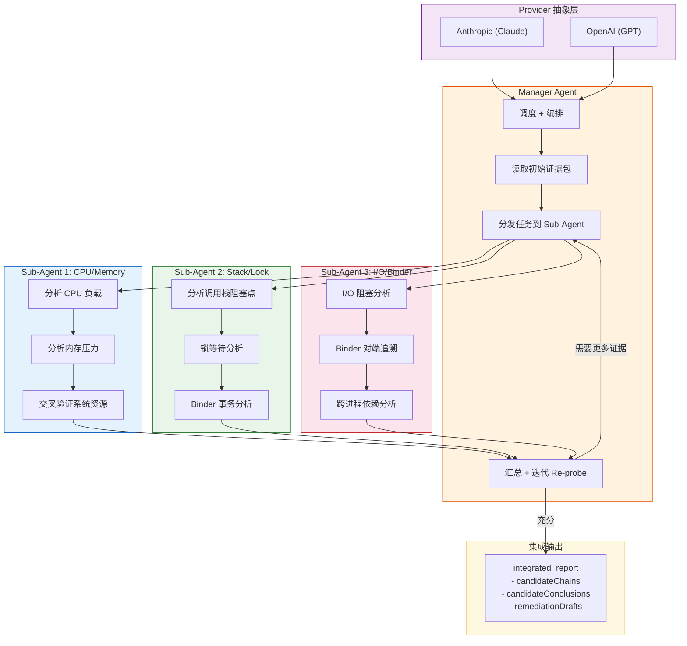
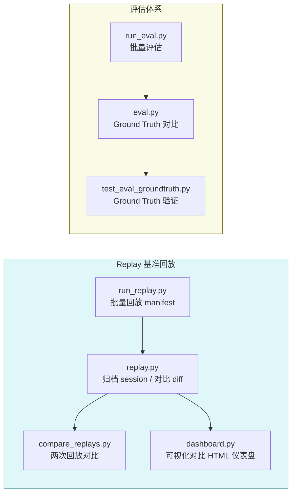
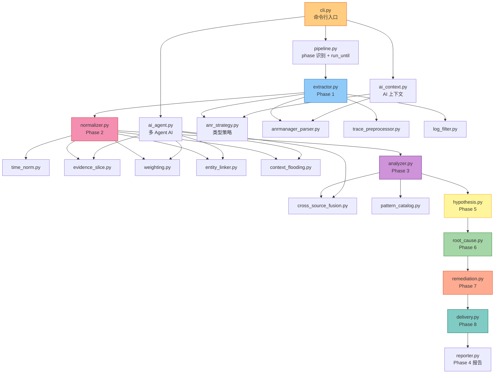
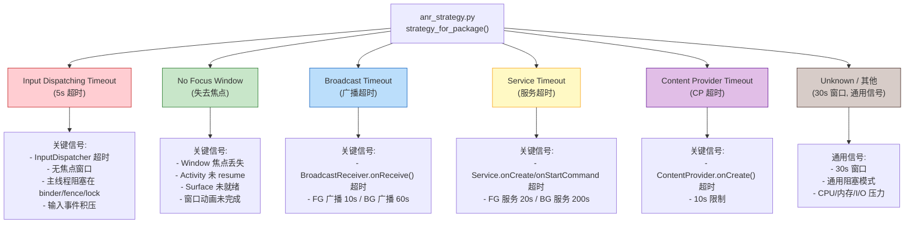
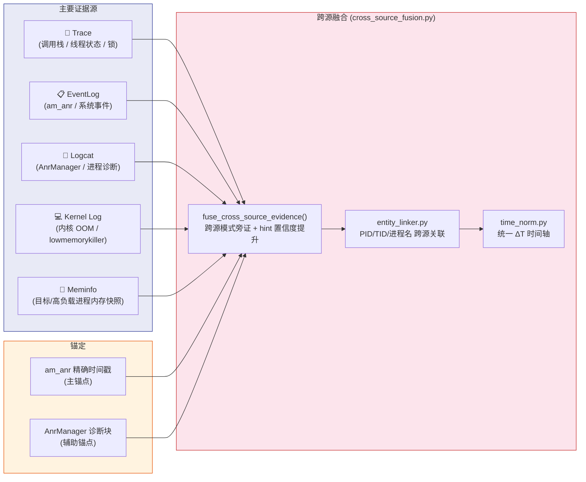

# agent-anr 完整流程架构图

> 自动生成日期: 2026-07-24
> 基于 `anr_evidence/` 核心模块 + `scripts/` 入口脚本 + `docs/anr-analysis-flow.md`

---

## 一、总览：从输入到交付

---

## 二、Phase 1-8 详细流水线

```mermaid
flowchart TD
    subgraph P1["Phase 1 — 证据提取 (extractor.py)"]
        P1A["extract_evidence_package()\n解析 trace / event_log / logcat / kernel_log"]
        P1B["extract_baseline_package()\n基线证据（不可删除）"]
        P1C["trace_preprocessor.py\nTrace 确定性结构化解析\n→ PID / 主线程 / 线程摘要 / block hint"]
        P1D["log_filter.py\nEventLog 两阶段过滤\n(ANR 前 12s 窗口 × 标签 × 包名)"]
        P1E["anrmanager_parser.py\n解析 AnrManager 诊断块"]
    end

    subgraph P2["Phase 2 — 标准化 (normalizer.py)"]
        P2A["normalize_evidence_package()\nprovenance 追踪 / 锚点对齐 / 降级标记"]
        P2B["time_norm.py\nΔT 时间归一化\n(每条记录相对 ANR 锚点的时间偏移)"]
        P2C["evidence_slice.py\nEvidenceSlice 结构化数据模型\n→ JSONL 读写 / 按 importance/ΔT/source 过滤"]
        P2D["weighting.py\n60 个标签 × 3 级重要性\n(Critical / Warning / Contextual)"]
        P2E["entity_linker.py\n跨源实体关联\n(trace PID/TID ↔ EventLog ↔ logcat ↔ kernel)"]
        P2F["context_flooding.py\n基于 importance 的截断策略\n→ 保留 Critical/Anchor 并显式报告预算溢出"]
    end

    subgraph P3["Phase 3 — 辅助分析 (analyzer.py)"]
        P3A["analyze_normalized_package()\n非根因裁决"]
        P3B["_build_timeline()\n关键事件时间线"]
        P3C["_build_signal_summary()\n信号汇总 (CPU/内存/IO/锁)"]
        P3D["_build_findings()\n可疑发现列表"]
        P3E["pattern_catalog.py\n已知 ANR 模式匹配"]
        P3F["cross_source_fusion.py\n跨源证据融合"]
    end

    subgraph P5["Phase 5 — 候选因果链 (hypothesis.py)"]
        P5A["generate_causal_draft()"]
        P5B["_build_candidate_chains()\n候选根因链路"]
        P5C["_confidence_level()\n置信度评估"]
        P5D["标记: notRootCauseYet = true\nrequiresHumanConfirmation = true"]
    end

    subgraph P6["Phase 6 — 保守根因 (root_cause.py)"]
        P6A["generate_root_cause_report()"]
        P6B["_candidate_conclusions()\n候选结论 + 支持证据"]
        P6C["_unresolved_questions()\n未确认项"]
        P6D["_global_limitations()\n证据局限性"]
    end

    subgraph P7["Phase 7 — 修复建议 (remediation.py)"]
        P7A["generate_remediation_drafts()"]
        P7B["_build_remediation_drafts()\n分级修复草案"]
        P7C["_priority() + _why_gated()\n优先级 + 门控理由"]
    end

    subgraph P8["Phase 8 — 交付 (delivery.py + reporter.py)"]
        P8A["render_final_delivery()\n汇总候选结论 + 因果链 + 修复建议"]
        P8B["render_analysis_report()\nMarkdown 报告生成"]
    end

    P1A --> P1B
    P1A --> P1C & P1D & P1E
    P1A --> P2A
    P2A --> P2B & P2C & P2D & P2E & P2F
    P2A --> P3A
    P3A --> P3B & P3C & P3D
    P3A --> P3E & P3F
    P3A --> P5A
    P5A --> P5B & P5C
    P5B --> P5D
    P5A --> P6A
    P6A --> P6B & P6C & P6D
    P6A --> P7A
    P7A --> P7B & P7C
    P7A --> P8A
    P8A --> P8B

    style P1 fill:#e3f2fd,stroke:#1565c0
    style P2 fill:#fce4ec,stroke:#c62828
    style P3 fill:#f3e5f5,stroke:#6a1b9a
    style P5 fill:#fff8e1,stroke:#f9a825
    style P6 fill:#e8f5e9,stroke:#2e7d32
    style P7 fill:#fff3e0,stroke:#e65100
    style P8 fill:#e0f2f1,stroke:#00695c
```

---

## 三、AI Context 生成与 AI 分析路径

---

## 四、多 Agent AI 推理架构

---

## 五、Replay & Eval 旁路

---

## 六、完整模块依赖图

---

## 七、ANR 类型策略分支

---

## 八、证据源与跨源融合

---

## 附：CLI 命令速查

| 命令 | 说明 |
|------|------|
| `python3 scripts/anr_to_ai.py <input>` | 生成 AI Context (`anr_ai_context/`) |
| `python3 -m anr_evidence <fixture>` | 运行 Phase 1 证据提取 |
| `python3 -m anr_evidence --analyze <fixture>` | 仅分析 (Phase 1-3) |
| `python3 -m anr_evidence --report <fixture>` | 推进至 Phase 7 并渲染 Phase 4 Markdown 报告 |
| `python3 -m anr_evidence --deliver <fixture>` | 最终交付 (Phase 1-8) |
| `python3 scripts/extract_bugreport.py <zip> -o <dir>` | 解压 bugreport |
| `python3 scripts/run_replay.py <manifest>` | 运行 Replay |
| `python3 -m unittest discover -s tests -v` | 运行所有测试 |
