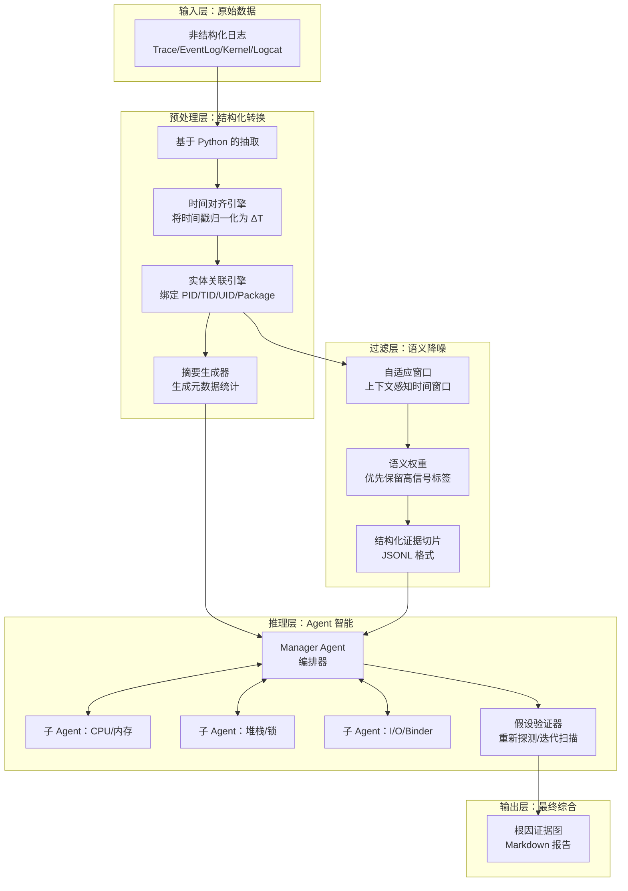

# ANR 智能分析系统：架构规范（v2.0）

## 1. 系统使命

通过 Agent 驱动的分层推理引擎，将海量、非结构化、多来源的 Android 日志转储（Trace、EventLog、Kernel、Logcat）转化为高保真、可执行的根因诊断报告。

## 2. 核心架构（“基于证据分析”的流水线）

系统采用四层解耦架构运行，数据流从 **原始数据** $\rightarrow$ **证据切片** $\rightarrow$ **假设生成** $\rightarrow$ **因果结论**。



---

## 3. 关键设计原则（“优化后”的核心）

### 3.1 数据转换：从“文本”到“证据切片”

系统**不会**将原始文本直接传给 LLM，而是传递**结构化证据切片**。

* **时间对齐（$\Delta T$）：** 所有时间戳（EventLog、Kernel 等）都会相对于 $T_{anr}$（`am_anr` 事件发生时间）进行归一化。所有日志均表示为 `timestamp_iso` 和 `offset_from_anr: +/- Xs`。
* **实体关联：** 预处理层会主动关联分散在不同来源中的标识符。在 `trace` 中发现的线程 ID（TID）会在元数据中明确映射到其所属进程 ID（PID）和包名，确保 Agent 在跨文件分析时不会丢失上下文。
* **摘要 Digest：** 每次分析都会生成一个 “Digest”（低 token 的元数据摘要），包括：
  * *搜索统计*：发现的错误数量、进程死亡频率。
  * *环境快照*：系统级压力（内存、CPU、I/O）。
  * *实体映射*：时间窗口内所有相关活跃 PID/UID 的注册表。

### 3.2 智能过滤：语义化与自适应

为避免“上下文泛滥”（Context Flooding），过滤层采用：

* **自适应窗口**：时间窗口并非固定为 12 秒。对于 `InputDispatching` 类型 ANR，窗口会扩展到 30 秒，以捕获更早的事件流。
* **语义敏感度权重**：为标签分配优先级权重。
  * **Level 1（Critical）**：`am_anr`、`am_crash`（主要触发信号）。
  * **Level 2（Warning）**：`am_kill`、`binder_transaction_timeout`（潜在原因）。
  * **Level 3（Contextual）**：`battery_level`、`wm_task_moved`（环境背景）。
  * *结果*：Agent 会收到高密度、高信号价值的事件流。

### 3.3 推理引擎：假设驱动的验证

分析层使用**迭代推理循环**来避免过早收敛。

1. **初始假设**：子 Agent 分析 “Summary Digest” 和 “Evidence Slices”，提出理论假设（例如：“PID 1234 中存在 Binder 死锁”）。
2. **迭代重采样（Probe）**：Manager Agent 可以触发 `re-probe` 命令。脚本会使用新的、高度局部化的时间窗口重新运行，或聚焦到单个线程/组件。
3. **最终综合**：`root-cause-reporter` 汇总因果链：`[触发因素] $\rightarrow$ [中间症状] $\rightarrow$ [根因]`。

---

## 4. 数据模式（脚本与 AI 之间的“契约”）

所有可用于分析的数据都必须符合 **Evidence Slice Schema（ESS，证据切片模式）**：

```json
{
  "metadata": {
    "anr_timestamp": "2026-05-01T09:00:15.000Z",
    "target_package": "com.example.app",
    "digest": {
      "total_events_analyzed": 450,
      "critical_findings": ["am_proc_died", "binder_error"],
      "system_pressure": "High (Memory)"
    },
    "entity_map": {
      "pid_1234": { "package": "com.example.app", "uid": 10002 }
    }
  },
  "evidence_slices": [
    {
      "source": "eventlog",
      "timestamp_iso": "2026-05-01T09:00:03.000Z",
      "delta_t_seconds": -12.0,
      "tag": "am_proc_died",
      "content": "am_proc_died: [0,1234,com.example.app,...]",
      "importance": "CRITICAL"
    },
    {
      "source": "kernel",
      "timestamp_iso": "2026-05-01T09:00:10.000Z",
      "delta_t_seconds": -5.0,
      "tag": "oom_killer",
      "content": "Out of memory: Kill process 1234...",
      "importance": "WARNING"
    }
  ]
}
```

## 5. 实施路线图

* [x] **架构设计（v2.0）**
* [ ] **Phase 1**：在 `anr_preprocessor.py` 中实现 `Temporal Alignment` 与 `Summary Digest`。
* [ ] **Phase 2**：在 `anr_log_pattern_filter.py` 中实现 `Semantic Weighting`。
* [ ] **Phase 3**：实现带重新探测能力的 `Hypothesis-driven` Agent 循环。
